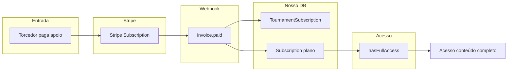
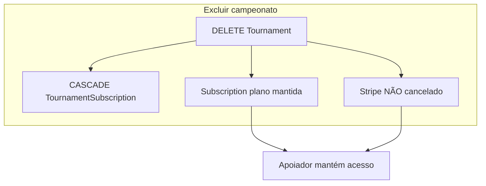

# Fluxo: Apoiador do time na meta → Assinante do portal (acesso completo)

Objetivo: quem apoia um time na meta do campeonato vira assinante do portal (acesso ao conteúdo completo). Se o campeonato for excluído depois, o apoiador mantém Stripe ativo e acesso ao portal.

---

## 1. Visão geral

```
┌─────────────────────────────────────────────────────────────────────────────────┐
│  TORCEDOR APOIA TIME NA META (checkout)                                           │
│       ↓                                                                          │
│  Stripe Subscription (recorrente) + metadata: tournamentId, teamId, userId        │
│       ↓                                                                          │
│  Webhook invoice.paid                                                            │
│       ↓                                                                          │
│  ┌─────────────────────────────┐    ┌─────────────────────────────────────────┐ │
│  │ TournamentSubscription      │    │ Subscription (plano portal)               │ │
│  │ (apoio: user + torneio +    │    │ userId + planId "acesso total"           │ │
│  │  time + stripeSubscriptionId)│    │ → hasFullAccess() = true                │ │
│  └─────────────────────────────┘    └─────────────────────────────────────────┘ │
│       ↓                                                                          │
│  Contagem de apoiadores atualizada; time pode ser confirmado ao bater meta       │
└─────────────────────────────────────────────────────────────────────────────────┘
```

---

## 2. Fluxo detalhado: primeiro pagamento (apoio)

```
[Torcedor] Clica "Quero apoiar este time" na página do campeonato
     │
     ▼
[Front] GET /torneios/[slug]/apoiar?teamId=xxx → carrega checkout
     │
     ▼
[Front] POST /api/tournament-goal/checkout { tournamentId, teamId }
     │
     ▼
[API] Valida torneio GOAL, time IN_GOAL, valor; busca/creates Stripe Customer
     │
     ▼
[API] stripe.products.create + stripe.subscriptions.create
      metadata: { userId, planId: 'tournament-goal', tournamentId, teamId }
     │
     ▼
[API] Retorna clientSecret → Front mostra PaymentElement (Stripe)
     │
     ▼
[Torcedor] Preenche cartão e confirma
     │
     ▼
[Stripe] Cobra; emite invoice.paid (primeira fatura da assinatura)
     │
     ▼
[Webhook] POST /api/webhooks/stripe — event: invoice.paid
     │
     ├──────────────────────────────────────────────────────────────────┐
     │  Se metadata.planId === 'tournament-goal'                         │
     │                                                                  │
     │  1) processTournamentGoalSubscriptionPaid(userId, tournamentId,  │
     │     teamId, subscriptionId)                                      │
     │     → Cria/atualiza TournamentSubscription (status ACTIVE)       │
     │     → recalculateGoalSupportersAndConfirm(tournamentId, teamId)   │
     │                                                                  │
     │  2) NOVO: Garantir Subscription (plano portal) para acesso total │
     │     → Buscar plano "Apoio Campeonato" (acessoTotal: true)        │
     │       ou usar plano genérico de acesso total existente            │
     │     → Se usuário não tem Subscription OU tem mas inativa:        │
     │         upsert Subscription: userId, planId, active: true,       │
     │         startDate: now, endDate: +1 mês (ou conforme ciclo),     │
     │         paymentGateway: 'stripe',                                 │
     │         externalSubscriptionId: stripeSubscriptionId             │
     │     → Se já tem Subscription ativa: renovar endDate (opcional)   │
     │                                                                  │
     │  return (não seguir para lógica de Plan normal)                  │
     └──────────────────────────────────────────────────────────────────┘
     │
     ▼
[Portal] hasFullAccess(userId) → consulta Subscription → active + endDate + plan.acessoTotal
     │
     ▼
[Apoiador] Tem acesso ao conteúdo completo (jogos, etc.)
```

---

## 3. Renovações (invoice.paid recorrente)

Cada vez que o Stripe cobra a mensalidade (novo `invoice.paid`):

- **TournamentSubscription:** já existe; pode atualizar `stripeSubscriptionId` ou manter.
- **Subscription (plano):** renovar `endDate` (ex.: +1 mês a partir de hoje) para que o acesso não expire enquanto o Stripe estiver cobrando.

Assim, `hasFullAccess()` continua true enquanto a assinatura Stripe estiver ativa.

---

## 4. Quando o admin exclui o campeonato

```
[Admin] Clica "Excluir campeonato" → confirma
     │
     ▼
[API] DELETE /api/admin/tournaments/[id]
     │
     ▼
[DB] prisma.tournament.delete({ where: { id } })
     │
     ├── CASCADE: tournament_teams      → apagados
     ├── CASCADE: tournament_matches     → apagados
     └── CASCADE: tournament_subscriptions → apagados
     │
     ▼
Stripe: assinaturas dos apoiadores NÃO são canceladas (não chamamos stripe.subscriptions.cancel)
     │
     ▼
Subscription (plano): NÃO é ligada ao Tournament; permanece no banco por userId
     │
     ▼
Apoiadores: continuam com Subscription ativa + Stripe cobrando
     → hasFullAccess() = true
     → Acesso ao conteúdo completo mantido, existindo ou não o campeonato
```

---

## 5. Cancelamento pelo usuário (Stripe)

Se o usuário cancelar no Stripe ou o pagamento falhar de forma definitiva:

- Webhook `customer.subscription.deleted` (ou lógica de invoice failed):  
  - Marcar **TournamentSubscription** como inativa (`endedAt`, status).  
  - Marcar **Subscription** (plano) como inativa (`active: false`) ou ajustar `endDate` para não dar mais acesso.  
Assim, o usuário deixa de ter acesso total quando deixar de pagar.

---

## 6. Entidades e responsabilidades

| Entidade                  | Função                                                                 |
|---------------------------|------------------------------------------------------------------------|
| **Stripe Subscription**   | Cobrança recorrente; fonte de verdade de “está pagando”.               |
| **TournamentSubscription**| Contagem de apoiadores; qual time/torneio; pode sumir ao deletar torneio.|
| **Subscription (plano)**  | Acesso ao portal (`hasFullAccess()`); independente do torneio existir.  |

---

## 7. Plano “Apoio Campeonato”

- Criar no admin um **Plan** (ex.: nome “Apoio Campeonato”, tipo recorrente, **acessoTotal: true**, preço pode ser 0 no nosso sistema pois o valor real vem do Stripe do apoio).
- Ou reutilizar um plano de acesso total já existente.
- **Implementado:** o código usa o primeiro plano ativo com `acessoTotal: true`. Se não existir nenhum, o apoiador não recebe Subscription do portal (é logado um aviso).

---

## 8. Resumo em um diagrama





---

*Documento: fluxo apoiador → assinante do portal e comportamento ao excluir campeonato.*
