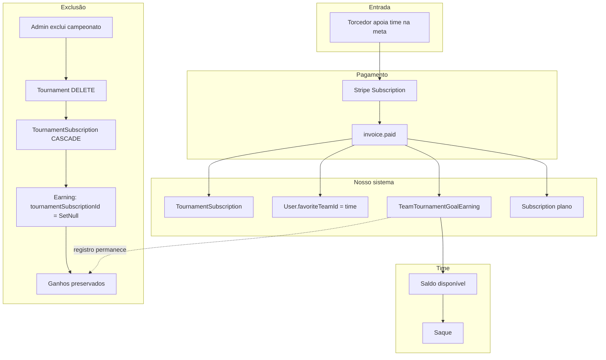
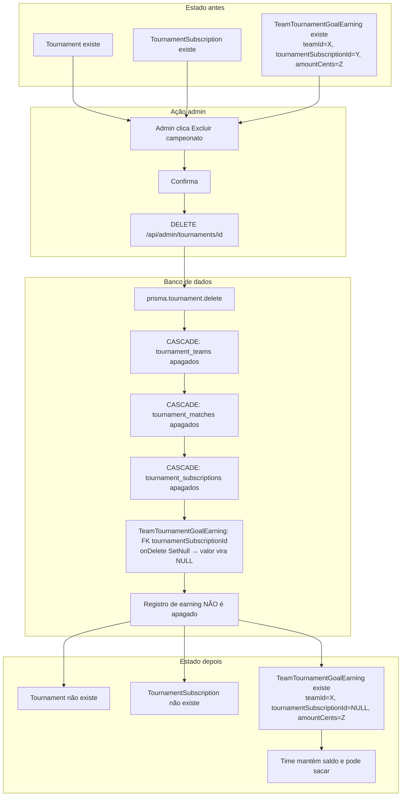
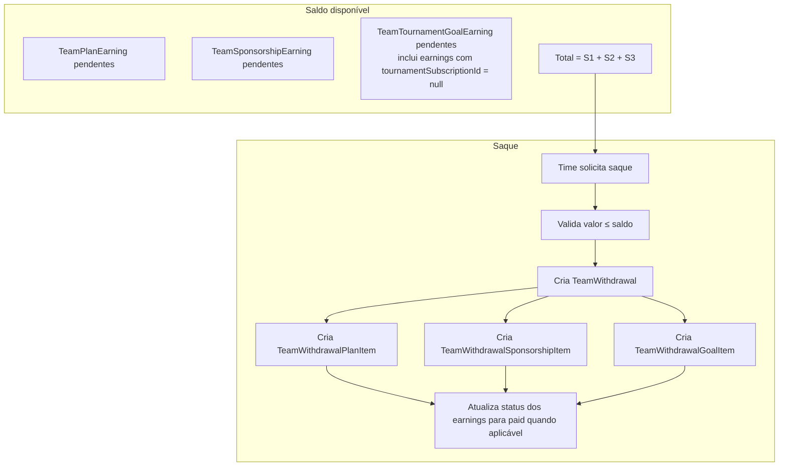
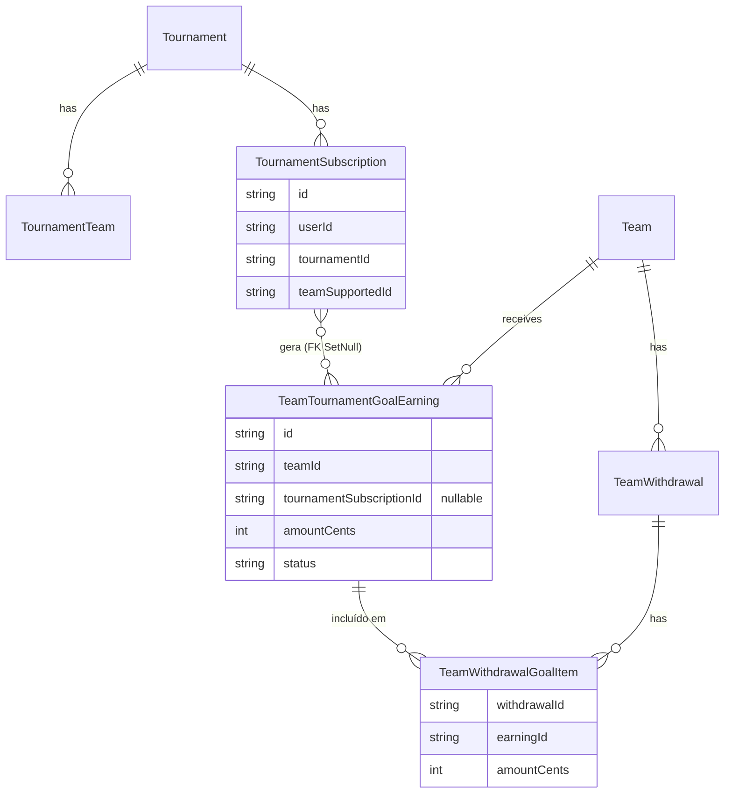

# Fluxograma completo: Apoio por meta, ganhos do time e exclusão do campeonato

Este documento descreve o fluxo completo desde o apoio do torcedor até a preservação dos ganhos do time quando o campeonato é excluído.

---

## 1. Pode manter os ganhos ao excluir o campeonato?

**Sim.** Basta modelar o earning com referência **opcional** à assinatura e **onDelete: SetNull**:

- **TeamTournamentGoalEarning** tem `tournamentSubscriptionId` **nullable** e relação com **TournamentSubscription** usando **onDelete: SetNull**.
- Ao excluir o **Tournament** → o banco apaga em cascata as **TournamentSubscription** daquele torneio.
- Para cada **TeamTournamentGoalEarning** que apontava para uma dessas assinaturas, o banco **não apaga** o registro; apenas coloca **tournamentSubscriptionId = null**.
- O earning continua com **teamId**, **amountCents** e **status** → o time mantém o saldo e pode sacar normalmente.

---

## 2. Fluxograma geral (visão de alto nível)

---

## 3. Fluxo detalhado: do apoio ao earning

```mermaid
flowchart LR
  subgraph Torcedor
    T1[Clica Quero apoiar este time]
  end

  subgraph Checkout
    T2[POST /api/tournament-goal/checkout]
    T3[Stripe Subscription criada]
    T4[metadata: userId, tournamentId, teamId, planId=tournament-goal]
  end

  subgraph Webhook invoice.paid
    W1[processTournamentGoalSubscriptionPaid]
    W2[TournamentSubscription criada/atualizada]
    W3[recalculateGoalSupportersAndConfirm]
    W4[ensurePortalSubscriptionForGoalSupporter]
    W5[User.favoriteTeamId = teamId]
    W6[Busca TournamentTeam.goalPayoutPercent]
    W7[amountToTeamCents = valor × percent / 100]
    W8[Cria TeamTournamentGoalEarning]
  end

  subgraph Persistência
    P1[(TournamentSubscription)]
    P2[(User)]
    P3[(TeamTournamentGoalEarning)]
  end

  T1 --> T2
  T2 --> T3
  T3 --> T4
  T4 --> W1
  W1 --> W2
  W2 --> W3
  W3 --> W4
  W4 --> W5
  W5 --> W6
  W6 --> W7
  W7 --> W8
  W2 --> P1
  W5 --> P2
  W8 --> P3
```

---

## 4. Fluxo: exclusão do campeonato e preservação dos ganhos

---

## 5. Fluxo do saque do time (incluindo ganhos de meta)

---

## 6. Diagrama de entidades (resumo)

---

## 7. Resumo em texto

| Etapa | O que acontece |
|-------|----------------|
| Torcedor apoia | Stripe Subscription (tournament-goal); metadata com tournamentId, teamId, userId. |
| invoice.paid | TournamentSubscription; User.favoriteTeamId = teamId; TeamTournamentGoalEarning (teamId, tournamentSubscriptionId, amountCents). |
| Renovações | Novos TeamTournamentGoalEarning a cada cobrança. |
| Admin exclui campeonato | Tournament DELETE → CASCADE TournamentSubscription. TeamTournamentGoalEarning.tournamentSubscriptionId vira NULL (SetNull); registro permanece. |
| Time saca | Saldo = plan + sponsorship + **goal** (inclui earnings com ou sem tournamentSubscriptionId). Saque pode incluir TeamWithdrawalGoalItem. |

**Conclusão:** os ganhos dos times são mantidos mesmo com a exclusão do campeonato, desde que o modelo TeamTournamentGoalEarning use `tournamentSubscriptionId` opcional com `onDelete: SetNull`.
