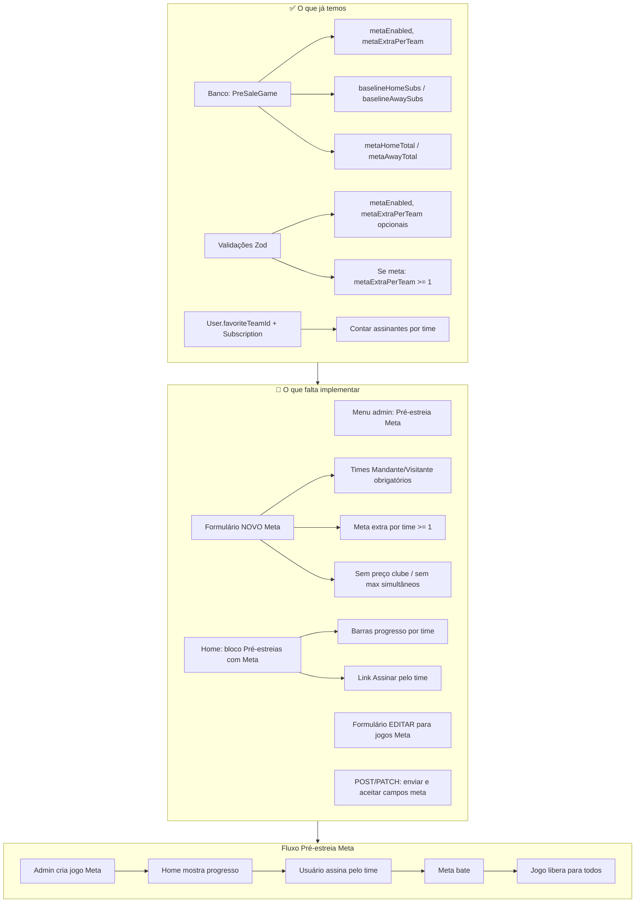

# Pré-estreia Meta — Desenho visual

## Diagrama (abrir este .md no VS Code/Cursor para ver o Mermaid abaixo)

---

## Resumo visual (texto)

| Área | Já temos | Falta |
|------|----------|--------|
| **Banco** | Campos meta no PreSaleGame | — |
| **Validações** | metaEnabled, metaExtraPerTeam, regras | — |
| **API POST** | Só modo Clubes | Enviar meta* e calcular baseline quando tipo Meta |
| **API PATCH** | Atualiza título, preços, etc. | Aceitar metaEnabled / metaExtraPerTeam |
| **Menu admin** | Item "Pré-estreia" (Clubes) | Item "Pré-estreia Meta" |
| **Admin novo** | Formulário Clubes (preço, simultâneos) | Formulário Meta (times + meta extra só) |
| **Admin editar** | Formulário único | Mostrar/editar meta nos jogos Meta |
| **Home** | Bloco "Pré-estreia" (todos) | Filtrar Clubes vs Meta; bloco "Pré-estreias com Meta" com progresso |

---

## Imagem gerada

Foi gerada uma imagem do desenho. Se o Cursor exibiu na conversa, você já a viu.  
Para abrir de novo: no Cursor, a imagem pode estar em **Assets** do projeto ou na pasta `.cursor` do workspace.
